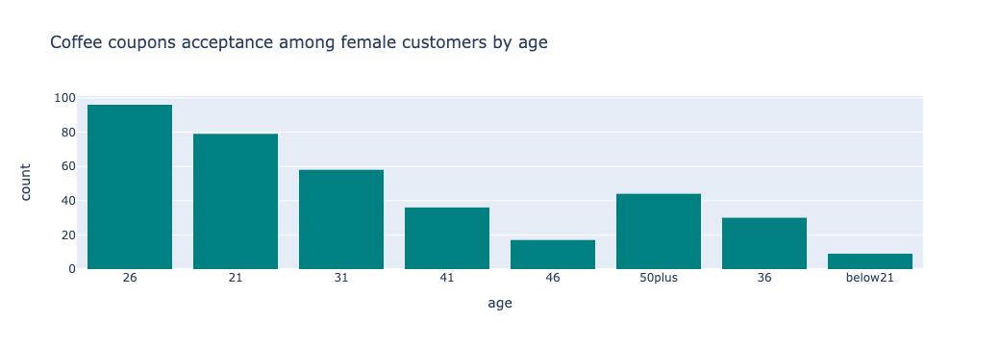
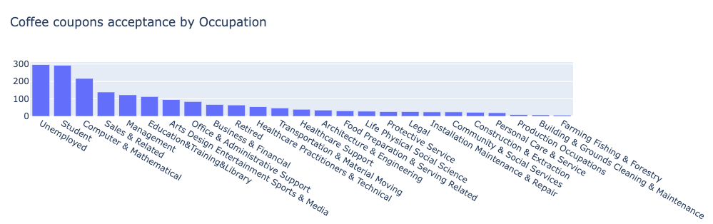

# DRIVER_COUPONS---Practical-Application-1

GOAL: Utilize data exploratory techniques to answer a business question, "Will a customer accept a coupon"? Distinguish between customers who accepted a driving coupon versus those that did not.

DATA: This data comes from the UCI Machine Learning repository and was collected via a survey on Amazon Mechanical Turk. The survey describes different driving scenarios including the destination, current time, weather, passenger, etc., and then ask the person whether he will accept the coupon if he is the driver. Answers that the user will drive there ‘right away’ or ‘later before the coupon expires’ are labeled as ‘Y = 1’ and answers ‘no, I do not want the coupon’ are labeled as ‘Y = 0’. There are five different types of coupons -- less expensive restaurants (under $20), coffee houses, carry out & take away, bar, and more expensive restaurants ($20-$50) 

After processing and cleaning the data, there is a total of 12,079 records in this dataset. Approximately 57% were customers who have chosen to accept the coupons and 43% customers did not accept the coupons.

Below is the distribution of coupons by type and it shows how popular coffee house are while bar coupons as less accepted type of coupon.

In this analysis, acceptance rates of Coffee Houses and Bar coupons were explored. Coffee Houses coupons is the most frequently distributed driver coupon, approximately 32% of the total coupons and Bar coupons are second to the lowest less frequently distributed coupon, approximately 18% of the total coupons distributed. 

Key Findings on Bar Coupons:

1. Customers who goes to bars more frequently are less likely to accept bar coupons than customers who goes to the bar less. If they like to go to bars, they will go regardless of having a coupon. On the other hand, less frequent bar goers are more likely to accept the coupon, as the 81% acceptance rate shows. In this group, bar coupons appeal to ages 21 to early 30s. Spending money in a bar is less priority for them, so bar coupons might be a good incentive. 

2. Customers going to bar more than once a month and over age of 25 are likely to accept bar coupons. This age group itself already assume the beginning of drinking stage and high social engagements. This group of customers  are either just started to go to bars or can also be the customers who have been going to bars more frequently. 

3. Customers with passengers who go to a bar more than once a month and have a passenger that is not a a kid and had other occupations other than farming, forestry and fishing are more likely to accept the coupon. Majority in this group are in drinking age and most likely live in urban areas because of their occupations. Hence more access to bars where they can actually use their coupons.

4. Customers with the income less than 50K and goes to cheap restaurant are less likely to accept bar coupons. Due to having a low income to begin with, there might be other expenses that customers in this group are spending on other than going to a bar.

Key Findings on Coffee House Coupons:

1. Customers who went to a coffee house less frequently are more likely to use the coffee house coupon, as the 70% acceptance rate shows compared to customers who come to coffee houses more frequently. Just like bar case in bar coupons, less frequent coffee drinkers can use the coupon as an incentive to go to a coffee house.

2. Acceptance rates are low regardless of marital status with customers who visits Coffee Houses frequently (more than 3 times a month). The acceptance rate for customers who are married and goes frequently to Coffee House is 11% and 19% for not married. As concluded in #1, coupons work well with customers who are not frequent visitors. 

3. Female customers who goes with their friends are less likely to accept coupons. Drinking coffee is a form of social engagement and obviously is enjoyed with friends with or without coupons. Majority of the females in this group are in the ages of 21 and 26. Apparently, this is the same trend as the male counterpart. Acceptance rate for female customers with friends is approximately 19% and 18% for males.

4. Customers who went to coffee house less frequently and is not married are more likely to want coupons than married customers. It appears that the difference in this group is that majority of the customers who are not married are on the income range between $12.5K to $50K compared to the married group having income between $50K to 100K. It is quite apparent that acceptance rates  are much higher in the not married group (43%) than in the married group (27%) . These customers who are not married has lesser income to spend for coffee and coupons will definitely work for them.

5. Majority of the customers who have accepted Coffee House coupons were either unemployed or a student. Much of the stress and free time of the unemployed is taken out on coffee while students drink coffee to stay up late and study.

6. Coffee coupons were accepted mostly when it is sunny. This makes sense due to the fact that customer tend to travel less when the weather is snowy and rainy.

RECOMMENDATIONS:

1. Coupons are most often for customers who have less to spend. Coupon offerings and marketing efforts should be increased in low income communities with a good population of students. A great target would be coffee houses next to university campus and their dorms. As mentioned in #4 above, students most likely are able to stay up late to study because of coffee. Therefore, the more coupon offers, the better since most students do not have a lot of income.

2. Bar coupons should probably have an added food component instead of only offering a coupon for a drink to attract those customers who do not like to consume too much alcohol. This would at least give them other ways to use their coupon(s).

